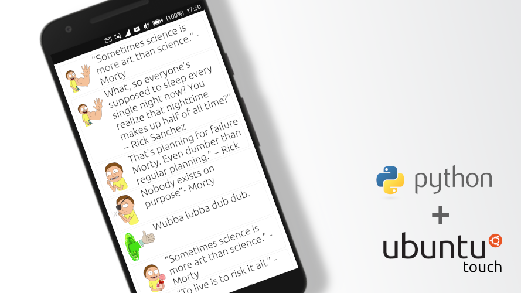

# Dynamically creating objects to ListBox with Python on Ubuntu Touch
[[статья на русском]](http://dtc1.ru/Динамическое%20создание%20объектов,%20то%20ли%20ListBox%20с%20картинками%20Python%20на%20Ubuntu%20Touch)

The result of executing a Python function can be not only information, but also objects. In this example, we'll show you how to create a ListBox with pictures.

**Let's create a new project in Clickable**, enter the command in the terminal:
    
    clickable create
	
Select the Python project type and fill in:  
Title \[App Title\]: Example Listbox 
App Name \[appname\]: example-listbox 

We remove all unnecessary in Main.qml and bring it to the form:

    MainView {
        id: root
        objectName: 'mainView'
        applicationName: 'example-listbox.yourname'
        automaticOrientation: true
        width: units.gu(45)
        height: units.gu(75)
        
        ListView {
            id: grig 
            anchors{
                fill: parent
                margins : units.gu(1);
            }
            spacing: units.gu(0.5)
            model: listModel
            delegate: ImgItem {
                text: txt
                image: img
            }
        }
        ListModel{
            id:listModel
        }
    }
	
Now let's create the new element - **ImgItem.qml**

    /*  ImgItem.qml */
    import QtQuick 2.7
    import QtQuick.Controls 2.2

    Rectangle {
            id: root
            radius: units.gu(0.5)
            border.width: units.gu(0.1)
            border.color: "#eee"
            width: parent.width
            height: childrenRect.height
            
        property alias image: img.source
        Image {
          id: img
          width: units.gu(10)
          height: {
            if (root.height < units.gu(10)) {
                units.gu(10)
              } else {
                root.height
              }
            }
          verticalAlignment: Image.AlignTop
          fillMode: Image.PreserveAspectFit
          anchors{
              top: parent.top
              left: parent.left
            }
        }
        property alias text: label.text
        Text {
            id: label
            font.pixelSize: units.gu(3)
            anchors{
              top: parent.top
              left: img.right
              right: parent.right
            }
            wrapMode : Text.WordWrap
            verticalAlignment: Text.AlignVCenter
            color: "#111"
        }
    }
	
Thus, we have created a ListView, each future item of which is based on an ImgItem.
To set the properties of our object, in **ImgItem.qml** we bind two variables:
***image: img.source
text: label.text***
Now in the ListView, we have assigned the relationship of these properties:
***text: txt
image: img***
The model itself has been moved to a separate **listModel** object, and we will now work with it.

In the project folder, find **src**. In this directory, create the **img** folder. And we load pictures from **src/img/**.

**example.py** bring to mind:

    import random
    txt = [
      "“To live is to risk it all.” -Rick",
      "What, so everyone’s supposed to sleep every single night now? You realize that nighttime makes up half of all time?” – Rick Sanchez",
      "“If I let you make me nervous, then we can’t get schwifty” -Rick",
      "That’s planning for failure Morty. Even dumber than regular planning.” – Rick ",
      "Nobody exists on purpose”- Morty",
      "“Don’t make the same mistakes I made. Don’t deify the people who leave you.” – Beth ",
      "“Sometimes science is more art than science.” -Morty ",
      "Wubba lubba dub dub."
    ]

    def speak():
        img="../src/img/"+str(random.randint(0,19))+".png"
        text=txt[random.randint(0,len(txt))]
        return [img,text]

Let's add a Python object:

    Python {
        id: python
        Component.onCompleted: {
            addImportPath(Qt.resolvedUrl('../src/'));
            for (var i = 0; i < 10; i++)  {
            importModule('example', function() {
                console.log('module imported');
                python.call('example.speak', [], function(returnValue) {
                    var newItem = {}
                    newItem.img = returnValue[0]
                    newItem.txt = returnValue[1]
                    listModel.append(newItem)
                })
            });
            }
        }
        onError: {
            console.log('python error: ' + traceback);
        }
    }

Thus, by calling **example.speak**, you are creating a new object. We assign properties from the returned array to it. Then add this object to our **listModel**

We can now compile and run our program.

